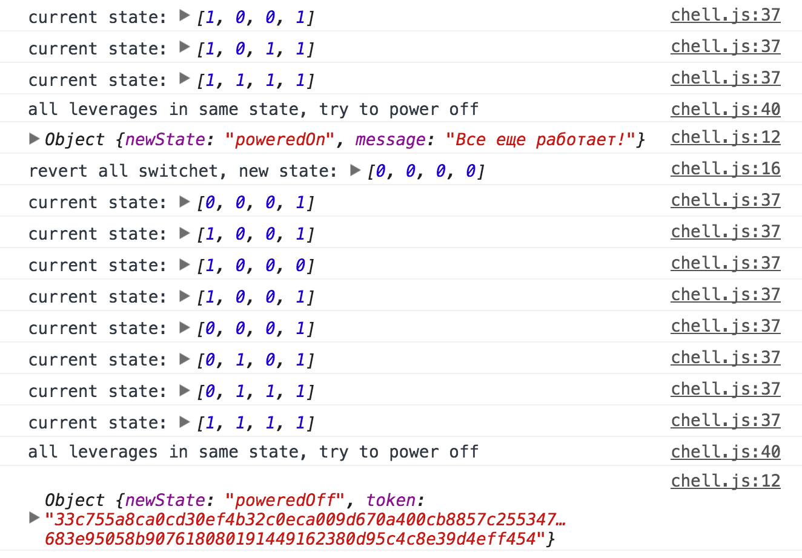
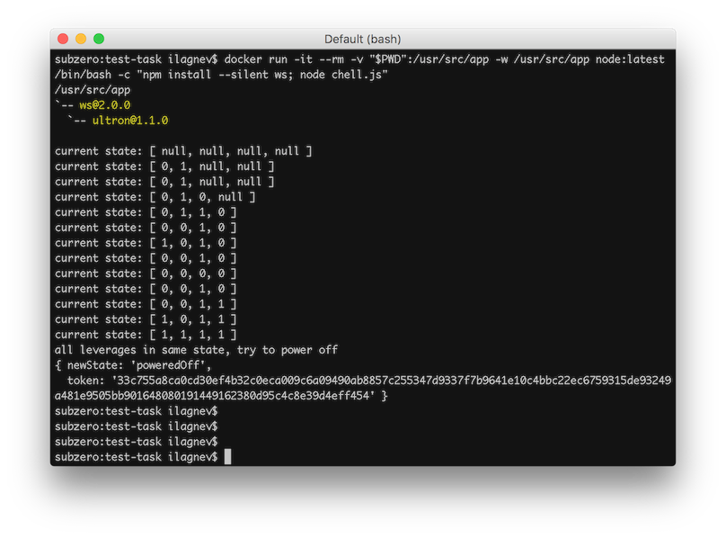

# jsninja test task

Предысторию можно почитать вот здесь: https://gist.github.com/xanf/759f231e5e1c7bb672d75bc4f9e99cf0

А для чего это все можно узнать на сайте http://javascript.ninja/

## Запуск через браузер
Для предотвращения аварии необходимо перейти на [ilagnev.com/jsninja-test-task](http://ilagnev.com/jsninja-test-task) и открыть Developer Tools (cmd+alt+i). 
Открыв вкладку консоли можно увидеть процесс выполнения программы и в итоге выключить Кейтлин

## Запуск в node.js через докер
Нужно выполнить команду ниже для запуск скрипта в ноде через докер (так-же ставится модуль WebSocket)

`docker run -it --rm -v "$PWD":/usr/src/app -w /usr/src/app node:latest /bin/bash -c "npm install --silent ws; node chell.js"`

