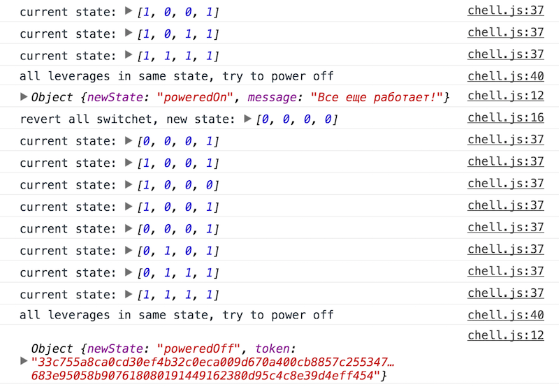

# jsninja test task

Для предотвращения аварии необходимо перейти [по этой ссылке](http://ilagnev.com/jsninja)
Открыв консоль можно увидеть процесс выполнения программы и в итоге выключить Кейтлин

Предысторию можно почитать вот здесь: https://gist.github.com/xanf/759f231e5e1c7bb672d75bc4f9e99cf0

А для чего это все можно узнать на сайте http://javascript.ninja/
